<p align = "center">
    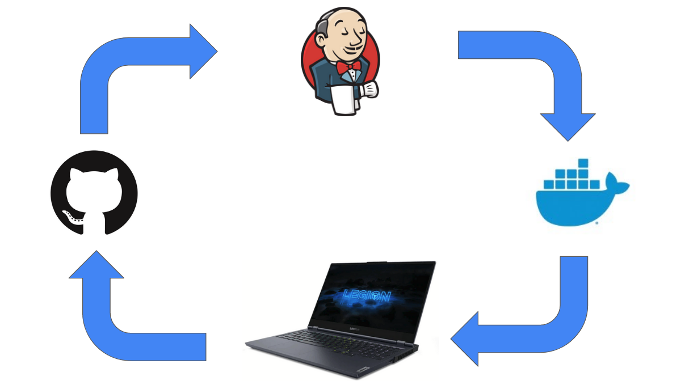
</p>

# Simple Build Pipeline using Jenkins 
> Objective: Create a simple build pipeline using Jenkins pulling from Github and deploying JupyterLab.

---
## Table of Contents
- [Introduction](#introduction)
- [Prerequisites](#prerequisites)
- [Installation](#installation)
  - [Part 1 - Setup Jenkins Container](#part-1---setup-jenkins-container)
  - [Part 2 - Jenkins Initial Setup](#part-2---jenkins-initial-setup)
  - [Part 3 - Adding Docker Credentials into Jenkins](#part-3---adding-docker-credentials-into-jenkins)
  - [Part 4 - Create Docker Hub Repo and Update Jenkinsfile](#part-4---create-docker-hub-repo-and-update-jenkinsfile)
  - [Part 5 - Creating A Jenkins Pipeline](#part-5---creating-a-jenkins-pipeline)
- [Post Setup](#post-setup)
  - [Part 6 - Start JupyterLab](#part-6---start-jupyterlab)
- [Supporting Documentation](#supporting-documentation)


---

## Introduction


---

## Prerequisites
Please have all of the following configured and ready to use on your local machine:
- [Docker](https://docs.docker.com/get-docker/)


---

## Installation
### Part 1 - Setup Jenkins Container
1. Clone this repository to your local machine. 
2. Ensure **Docker** is running on your local machine. You can see if Docker is running by typing `systemctl is-active docker` in the CLI.
    - See [Docker Help](https://docs.docker.com/get-docker/) for installation support if you do not already have **Docker** running on your local machine.
3. Type `sh runMe.sh` in the command line interface (CLI) of the local repo to run the Shell command. Follow the directions and on-screen prompts to launch a **Docker** container running an image of **Jenkins**.

By this point, a **Jenkins** container will be running on your local machine. However, if this is your first time running **Jenkins** on this machine, you will need to perform a one time setup. This is outlined in Part 2. If additional support is needed, please see the [Jenkins post-installation setup wizard page](https://www.jenkins.io/doc/book/installing/docker/#setup-wizard). You will need the intial admin password from the **Docker** logs for the `myjenkins-blueocean` container.
> Note: If you ran the `runMe.sh` Shell file but had to leave the set up by this point, you can run the Shell command again to start the **Jenkins** containers. This can be used after the installation is complete as a way to start your **Jenkins** if you wish to explore other **Jenkins** projects.

<br>

### Part 2 - Jenkins Initial Setup
1. Type `docker ps -a` in the CLI to find the **Docker** container ID for your `myjenkins-blueocean:2.319.2-1` image.

<p align = "center">
    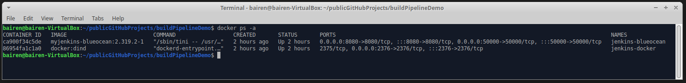
</p>

2. To obtain the initial admin password, type: `docker logs <container ID>` where the container ID is the ID for myjenkins-blueocean:2.319.2-1 in the CLI. The password will appear in the following message:

```pt
*************************************************************
*************************************************************
*************************************************************

Jenkins initial setup is required. An admin user has been created and a password generated.
Please use the following password to proceed to installation:

7c5d354a49c241748bed58e0a7486b8f

This may also be found at: /var/jenkins_home/secrets/initialAdminPassword

*************************************************************
*************************************************************
*************************************************************

```
3. Open your browser and go to the webpage [http://localhost:8080/](http://localhost:8080/) to access **Jenkins**.
4. Type in the intial password and follow the prompts on screen to unlock **Jenkins**. 

<p align = "center">
         
</p>

> Note: The following steps are from the [Build a Python app with PyInstaller](https://www.jenkins.io/doc/tutorials/build-a-python-app-with-pyinstaller/#unlocking-jenkins) tutorial. The steps have been copied to the README file for convenience. 

5. After unlocking Jenkins, the **Customize Jenkins** page appears. On this page, click **Install suggested plugins**.
6. When the **Create First Admin User** page appears, specify your details in the respective fields and click **Save and Finish**.
7. When the **Jenkins is ready** page appears, click **Start using Jenkins**.
8. When the Jenkins is ready page appears, click Start using Jenkins.

    > Note: This page may indicate **Jenkins is almost ready!** instead and if so, click **Restart**. If the page doesn’t automatically refresh after a minute, use your web browser to refresh the page manually.

9. If required, log in to **Jenkins** with the credentials of the user you just created. You’re ready to start using Jenkins!

<br>

### Part 3 - Adding Docker Credentials into Jenkins
1. Click Manage Jenkins
2. Click Manage Credentials
3. Under Stores Scoped to Jenkins, click Jenkins
4. Click Global Credentials
5. Click Add Credentials
6. Fill out username, password and a meaninful description. Name the ID `docker-creds` so that the Jenkinsfile can read these credentials.
7. Click **Ok** when finished.

<p align = "center">
        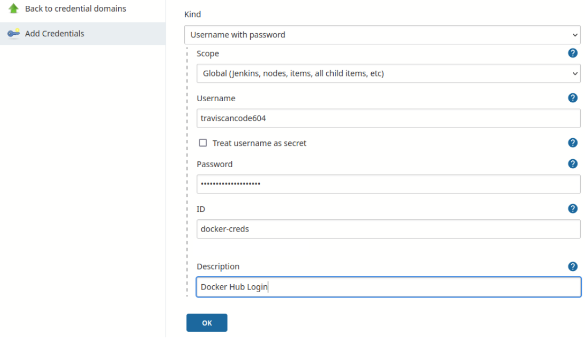 
</p>

<br>

### Part 4 - Create Docker Hub Repo and Update Jenkinsfile 
1. Go to Docker Hub and create a new public repository. For this demo, the repo was named `build-pipeline-demo`.

<p align = "center">
        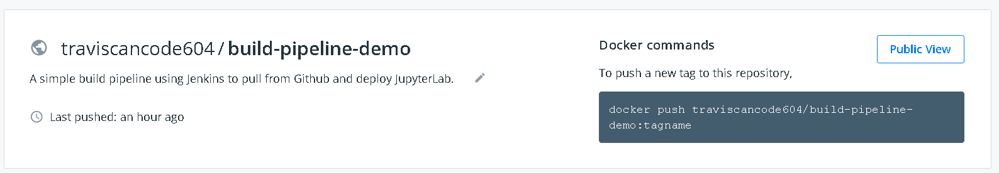 
</p>

2. Open the Jenkinsfile and edit lines 38 and 40 to have a link to your **Docker Hub** repo.

<p align = "center">
         
</p>

<br>

### Part 5 - Creating A Jenkins Pipeline
1. From the Jenkins Dashboard, click New Item.

<p align = "center">
    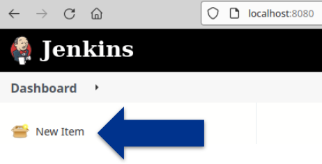 
</p>

2. Enter a name for the new pipeline in the **Enter an item name** field.
3. Select **Pipeline**, then click **OK** at the bottom of the page.

<p align = "center">
    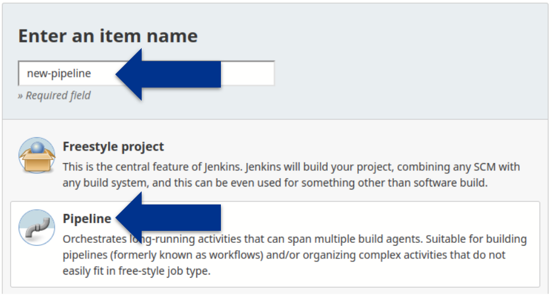 
</p>

4. On the new page, give the pipeline a description.
5. Click the **Pipeline** tab at the top of the page.
6. Select a definition of **Pipeline Script from SCM**. 
7. From **SCM**, choose **Git**.
8. Type your Git repository  path in the **Repository URL field**.
9. Under branches to build, select the appropraite branch (for my repo, this was `main`)

<p align = "center">
    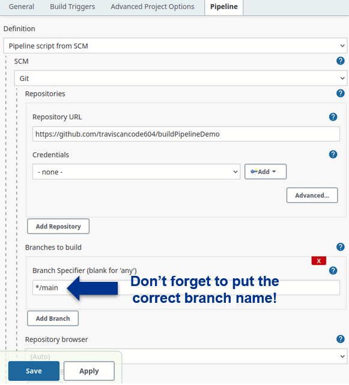 
</p>

10. Click **Save** at the bottom of the page.
11. A new page should load for the pipeline. On the left hand side, click **Open Blue Ocean** to access the Blue Ocean interface. 

<p align = "center">
    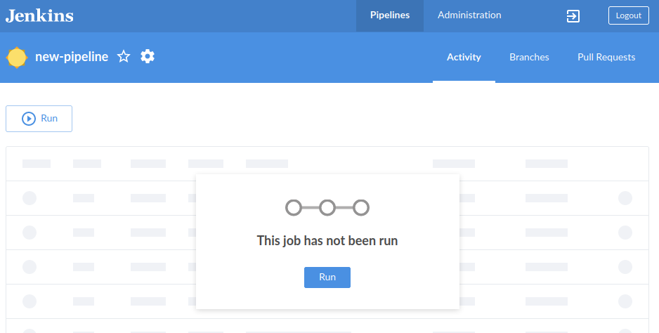 
</p>

12. Assuming this is your first time on this screen, you will have a prompt that says "This job has not been run". Click **Run**. This will run the **Jenkinsfile** from the Git repository.
13. Click the row with your pipeline name to view the status of the job.
14. When the job is complete, you should see a screen like this:

<p align = "center">
    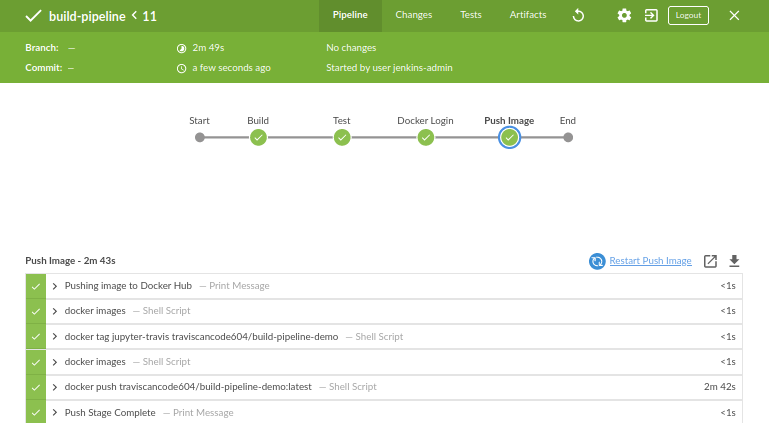 
</p>

## Post Setup
By this point, **Jenkins** will have built a **Docker** image of **JupyterLab** and uploaded it to **Docker Hub**. You can safely leave **Jenkins**. You are also now ready to pull this new Docker image to any machine running **Docker**!

### Part 6 - Start JupyterLab
1. In your CLI, type `docker run -it --rm --name jupyter -p 8888:8888 traviscancode604/build-pipeline-demo`. You should get a message like this in your CLI:

```pt
Serving notebooks from local directory: /home/jovyan
0 active kernels
Jupyter Server 1.13.4 is running at:
http://f6eed57b27b0:8888/lab?token=a20e3ac554e503a621add091cb9c28368eecacd4e8bfbad7
 or http://127.0.0.1:8888/lab?token=a20e3ac554e503a621add091cb9c28368eecacd4e8bfbad7
```
2. Copy the link from the CLI and paste it into your browser.
  Note: that if you follow the link in your browser without the generated token at the end (e.g.: `?token=a20e3...`), Jupyter will contest you for credentials.

You should see a screen like this:

<p align = "center">
    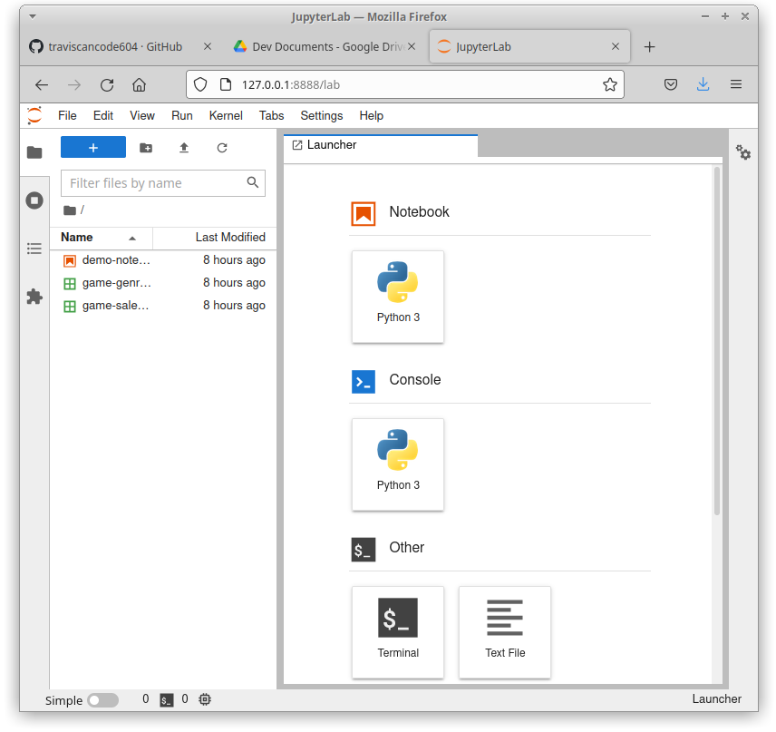
</p>

<p align = "center">
<b>Congratulations! You now have a container of JupyterLab (for Python) running on your machine with a demo notebook ready for use!</b>
<br>
</p>

The Image was built with a data and a Python Notebook included. Double click `demo-notebook.ipynb` to launch the notebook:

<p align = "center">
    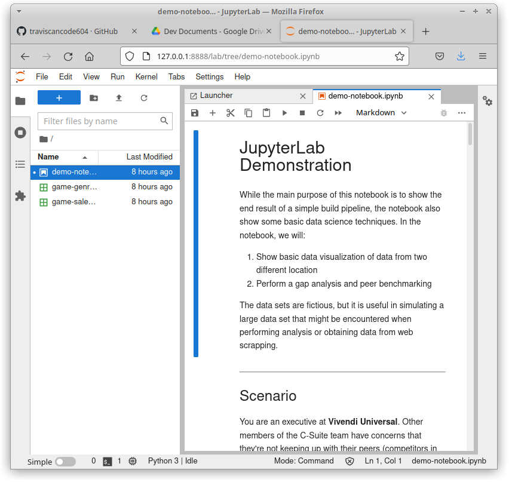
</p>


---

## Supporting Documentation
While the intent of this README was to include all of the required steps for demonstration, you may be interested in the following topics for a deeper understanding.

### How to Make A Basic Jenkinsfile
- [Jenkins Tutorial - Build a Python app with PyInstaller](https://www.jenkins.io/doc/tutorials/build-a-python-app-with-pyinstaller/)
- [Jenkinsfile Pipeline Syntax](https://www.jenkins.io/doc/book/pipeline/syntax/)

### Pushing Images to Docker Hub via Jenkins
- [Jenkins Pipeline to Create Docker Image and Push to Dockerhub](https://medium.com/swlh/jenkins-pipeline-to-create-docker-image-and-push-to-docker-hub-721919512f2)
- [How To Push a Docker Image To Docker Hub Using Jenkins](https://medium.com/codex/how-to-push-a-docker-image-to-docker-hub-using-jenkins-487fb1fcbe25)

